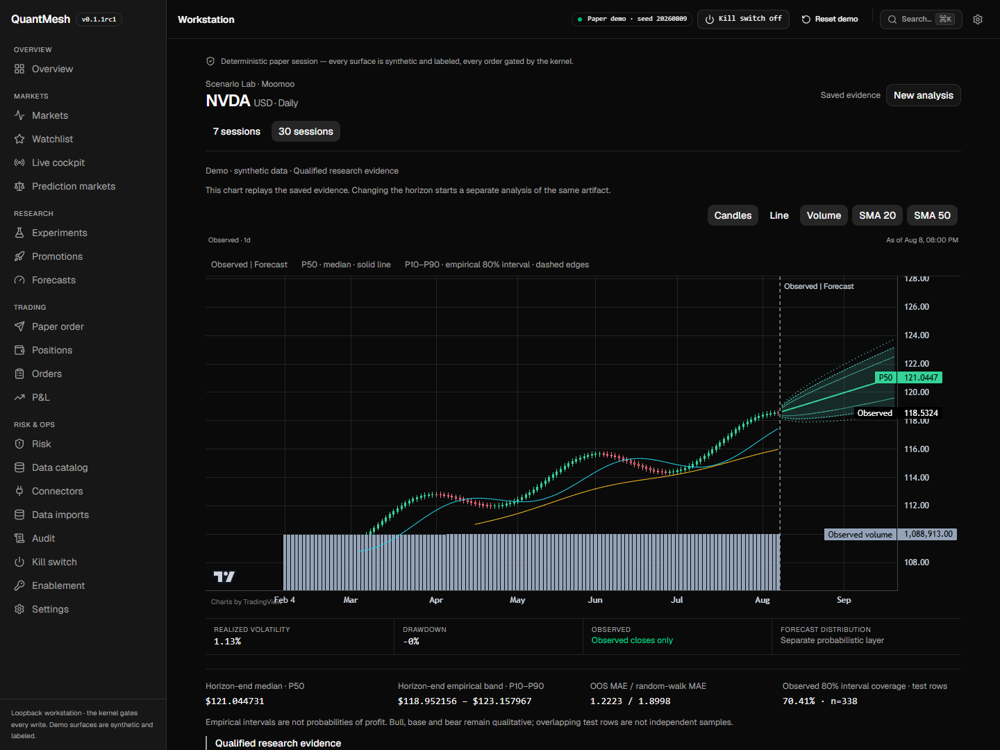
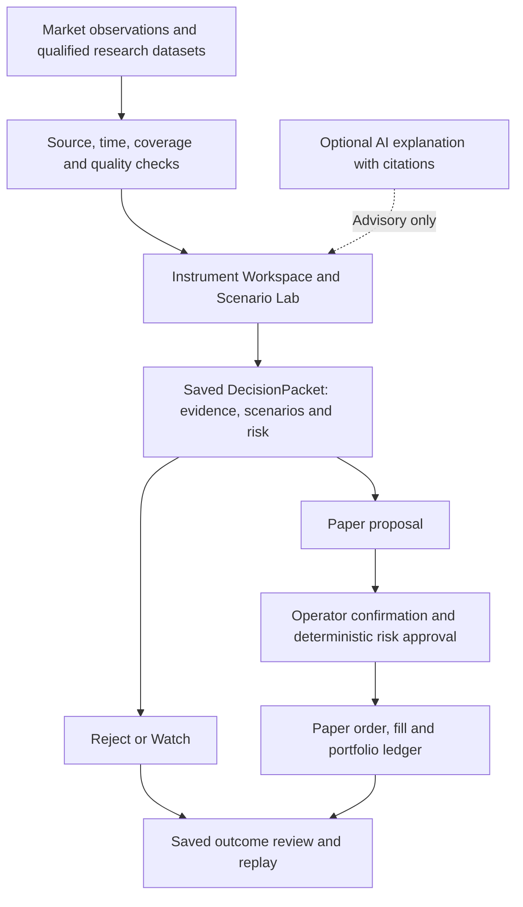

<div align="center">

# QuantMesh

**From market evidence to a decision you can replay.**

A local-first workstation for cross-market research, probabilistic scenarios,
and deterministic paper trading.

[Quick start](#quick-start) · [Workflows](#what-you-can-do) ·
[Production readiness](#production-readiness) · [Documentation](#documentation) ·
[简体中文](README.zh-CN.md)

[](https://github.com/ZP151/quantmesh/actions/workflows/ci.yml)
[](https://github.com/ZP151/quantmesh/actions/workflows/security.yml)
[](LICENSE)

</div>

QuantMesh helps an individual researcher or active trader connect a chart to
the evidence, uncertainty, risk, and outcome behind a decision. Inspect an
instrument, save a **DecisionPacket**, choose Reject, Watch, or a Paper proposal,
and revisit exactly what was known when you made the call.

**Current stage:** an accepted local prototype with a bounded private AWS
acceptance station. `v0.1.1-rc1` is the accepted prototype baseline; `main`
includes later decision, scenario, review, and live-chart work through iteration
0035. Final `v0.1.1` promotion and real-money execution remain gated. See
[production readiness](#production-readiness) for the evidence and its limits.



*Scenario Lab, captured from the local demo on 2026-09-15. All prices and
forecasts shown are synthetic; this is a product walkthrough, not live-market
or investment-performance evidence.*

## Why QuantMesh?

Market research often ends with a screenshot, notebook, or trade that loses
the reasoning behind it. QuantMesh keeps that reasoning attached to the result.

- **Make the decision in one workspace.** Bring observed prices, Bull/Base/Bear
  scenarios, forecast evidence, and risk into the same instrument view.
- **Know what the data can support.** Inspect source, timestamps, actual
  coverage, freshness, and missing evidence before acting.
- **Rehearse with deterministic controls.** Paper decisions pass quote fences,
  position limits, cost models, and kill switches; AI cannot bypass them.
- **Learn from the original evidence.** Saved forecasts and outcome reviews
  retain their identities so later data cannot silently rewrite the decision.

The product goal is **reproducible decision loops completed**: inspect evidence,
record a decision, rehearse or reject it, and recover the evidence and outcome
after restart. See the [product strategy](docs/product-strategy.md) for the
target users and measurement criteria.

## What you can do

| Workflow | In the workstation | Result and scope |
| --- | --- | --- |
| Start a decision session | Open the Decision Inbox, inspect readiness, explicitly refresh local watches, and open an exact packet. | Focus on triggered, blocked, or review-due decisions; refresh does not start provider ingestion. |
| Investigate an instrument | Compare charts, scenarios, provenance, current paper exposure, and risk in Instrument Workspace. | Save Reject, Watch, or a Paper proposal with linked evidence. |
| Explore a scenario | Use Scenario Lab for AAPL/NVDA daily analysis with 7/30-session forecast evidence and saved chart context. | Replay a saved analysis; missing or unqualified evidence blocks dependent actions. |
| Watch real crypto markets | Open BTC/ETH/SOL from Markets or Watchlist in the configured live runtime. | Inspect source-labelled price lines/candles and retained intraday observations. |
| Rehearse a trade | Review and confirm a paper proposal through deterministic risk checks. | Trace the order, fill, positions, P&L, and audit; a proposal alone does not submit an order. |
| Review an outcome | Compare a saved forecast with exact realized daily closes and record a review. | Inspect error and interval-hit metrics; incomplete paths cannot receive complete-path scores. |

The interface supports English / Simplified Chinese, system / light / dark
themes, keyboard navigation, and locally persisted display preferences.

### How it works



A **DecisionPacket** is the versioned record of one instrument's as-of market
state, scenarios, risk plan, evidence references, and operator decision. Its
links to later paper and review records make the full loop inspectable.

## Quick start

### Run the local demo

Requirements for this pinned setup: **Git and Python 3.13** (the CI baseline).
Windows PowerShell is the primary local
operator path; Linux is exercised by CI and private staging. The Python package
includes the built React app, so Node.js and a frontend build are unnecessary
to run it. The demo needs no broker account, wallet, or model API key.

From a new directory in PowerShell:

```powershell
git clone https://github.com/ZP151/quantmesh.git
Set-Location quantmesh
py -3.13 -m venv .venv
.\.venv\Scripts\python.exe -m pip install --upgrade pip
.\.venv\Scripts\python.exe -m pip install -e . -c requirements-audit.txt
.\.venv\Scripts\quantmesh-workstation.exe --demo
```

Open [the workstation](http://127.0.0.1:8765/app/). Keep the terminal running;
press `Ctrl+C` to stop. Explicit executable paths avoid requiring PowerShell
script activation. Reference submodules are not needed for this demo.

<details>
<summary>Linux shell equivalent</summary>

```bash
git clone https://github.com/ZP151/quantmesh.git
cd quantmesh
python3.13 -m venv .venv
.venv/bin/python -m pip install --upgrade pip
.venv/bin/python -m pip install -e . -c requirements-audit.txt
.venv/bin/quantmesh-workstation --demo
```

Use Python 3.13 with venv support. The URL is the same.

</details>

### Try one decision loop

1. Confirm the **Demo** label, then open NVDA from Markets or Watchlist.
2. Inspect its chart, Scenario Lab, forecast horizon, and evidence status.
3. Expand **Risk & decision**, enter a **Decision reason**, and select
   **Watch decision** or **Reject decision** to save the analysis. For a paper
   rehearsal, inspect the proposal and confirm it only when its evidence and risk gates allow it.
4. Reload the saved packet URL and expand **Monitoring & review**. Check the
   original evidence and any available outcome; a not-yet-observed outcome stays pending.
5. Use **Reset demo** to return to the seeded scenario when needed. Reset is
   limited to the marked demo root.

Demo prices and forecasts are synthetic, clearly labelled, and deterministic.
They demonstrate the workflow and do not establish predictive performance.

### Connect read-only live data

Stop the demo process, then run:

```powershell
$env:QUANTMESH_LIVE_WATCHLIST = "BTC,ETH,SOL"
.\.venv\Scripts\quantmesh-workstation.exe --live
```

This connects to public Hyperliquid perpetual-market data; no wallet is needed.
Open **Markets → Live instruments** or **Watchlist → Live instruments**, select
a coin, and use **1D / Line**. Initial charts may show collecting/unavailable
until sufficient observations arrive. The chart reports actual recorded
coverage; selecting 1D does not imply a complete day of history.

`--live` selects a **market-data runtime**. Paper mode remains the default and
real-money execution stays disabled. `--demo` and `--live` are mutually exclusive.
Use the [live chart acceptance guide](docs/runbooks/live-chart-acceptance.md)
and [connector checklist](docs/runbooks/live-cockpit-operator-checklist.md)
to check source freshness and degraded states.

## Markets and operating modes

| Surface | Available scope | Setup and acceptance boundary |
| --- | --- | --- |
| Local demo | Seeded cross-market research and paper workflows; AAPL/NVDA scenario and review paths. | Credential-free, synthetic, resettable. |
| Hyperliquid live data | Public BTC/ETH/SOL perpetual quotes, market observations, and intraday line/candle charts. | Network access required. Private AWS acceptance covers these three instruments and their observed coverage. |
| Moomoo equities | Read-only OpenD adapter and AAPL/NVDA workspace paths. | Requires a reachable OpenD host and actual market-data entitlements. Private AWS reachability and real-source acceptance are next; existing polling is not native tick push. |
| Prediction markets | Polymarket/Kalshi discovery, mapping, probability, and connector foundations. | All-market AWS acceptance is outstanding. Active Polymarket subscriptions/mapping and required Kalshi WebSocket authentication are separate work. |
| Private AWS staging | Single-operator workstation, private HTTPS, persistent data, exact-build health, and retained-release rollback. | Explicit setup via the [staging runbook](docs/runbooks/aws-private-staging.md); instance-firewall acceptance remains open in [#135](https://github.com/ZP151/quantmesh/issues/135). |

Recorded intraday replay is separate from manifest-qualified historical data.
Live prices alone do not qualify a forecast, unblock a paper decision, or
promote a strategy. Venue access and data rights must be checked separately.

## Data and action boundaries

**Local-first describes the default runtime and storage.** Connected feeds
communicate with market-data providers. Optional AI uses the configured model
gateway; the default endpoint is loopback. Explicitly authorized remote model
integrations can send research content off the machine.

| Boundary | Behavior |
| --- | --- |
| Local state | Defaults under `~/.quantmesh`: demo state is isolated in `demo`; live observations, orders, decisions, and research artifacts have separate roots. Settings use the `QUANTMESH_` prefix; see [configuration](src/quantmesh/settings.py). |
| Network access | The workstation binds to loopback. Private staging keeps that bind behind Tailscale HTTPS and an exact configured browser origin. It is a single-operator deployment. |
| Data quality | Real, delayed, stale, unavailable, synthetic, and replayed states stay distinguishable. Missing evidence is reported explicitly. |
| AI | Optional, structured, and advisory. AI may explain cited evidence; it cannot sign, place, cancel, or resize orders. |
| Trading | Paper is the default. Deterministic risk approval, quote freshness, limits, and kill switches govern the order path. Live execution requires a separate authorized release and evidence gates. |
| Recovery | Retain data and exact release identity. Inspect journals and reconciliation before retrying an interrupted action; follow the linked incident runbooks. |

Keep credentials, private keys, local configuration, and private research logs
out of commits and issue reports. Research and forecasts carry uncertainty;
the project makes no promise of profitable predictions.

## Production readiness

QuantMesh is being built for dependable daily operation. Its current evidence
supports bounded prototype and private-staging use; general production
availability and real-money readiness have not been established.

### Recorded evidence

- **Accepted prototype:** `v0.1.1-rc1` passed the recorded clean-checkout release
  and browser acceptance gates. It remains an immutable baseline; later `main`
  changes are not included in that tag. See [iteration 0020](docs/iterations/0020-research-to-paper-loop.md).
- **Decision and learning loop:** iterations 0027–0029 and 0032–0033 added
  evidence-backed decisions, readiness, Scenario Lab, and exact saved forecast
  review. Their [iteration records](docs/iterations/INDEX.md) distinguish
  implementation checks from operator and deployment evidence.
- **Private real-chart acceptance:** on **2026-09-13**, deployed build
  [`76203e0`](https://github.com/ZP151/quantmesh/commit/76203e03476b120e149a0c06d9932849bb4d8e14)
  passed a **601.662-second** paired AWS witness for BTC/ETH/SOL. All six
  Markets/Watchlist entry paths, actual minute revisions/appends, and reload
  retention passed. All **296 workspace requests** completed with no failures
  or timeouts; paper was enabled and live execution disabled. See the
  [portable evidence](docs/iterations/evidence/0035/aws-sustained-witness-summary.json)
  and [full ledger, including earlier failures](docs/iterations/0035-live-instrument-charts.md).

That ten-minute witness is scoped to one build, environment, and instrument
set. It does not establish indefinite uptime, complete historical coverage,
forecast quality, or current health of another deployment.

### Gates before broader use

- Complete independent [168-hour data-fabric soak evidence](https://github.com/ZP151/quantmesh/issues/124)
  and the [private staging firewall acceptance](https://github.com/ZP151/quantmesh/issues/135).
- Verify each additional venue against actual connectivity, subscriptions,
  entitlements, source timestamps, and unavailable/closed-market states.
- Bind qualified, calendar-correct history to the scenario and review loop;
  require chronological out-of-sample evaluation and fees, spread, and slippage
  before strategy promotion. Forecast error is not trading performance.
- Repeat the [release gate](docs/release-process.md), recovery drills, and
  operator acceptance for the exact artifact being distributed or deployed.
  Final release promotion remains an explicit operator decision.

## Roadmap

| Stage | Outcome |
| --- | --- |
| Delivered: foundation and workstation, 0001–0020 | Deterministic paper kernel, research/data adapters, risk/audit, React workstation, localization, and instrument decision workspace. |
| Delivered: durable evidence, 0021–0026 | Trusted data fabric, durable ledgers, reconciliation, numeric policy, and local runtime assembly; soak remains a separate gate. |
| Delivered: decisions and learning, 0027–0029 / 0032–0033 | Decision Copilot, Inbox, readiness session, Scenario Lab, and frozen forecast-versus-outcome review. |
| Accepted bounded deployment: 0034–0035 | Private BTC/ETH/SOL live observations and replayable real charts. |
| Next | Private Moomoo/OpenD reachability and AAPL/NVDA entitlements, then prediction-market source acceptance. |
| Then | Qualified historical data through scenarios, decisions, and review; expand models only for demonstrated workflow gaps. |
| Separately gated | Final release promotion and guarded broker/testnet or real-money execution. |

The [current delivery plan](docs/ITERATION_PLAN.md) governs sequence and
acceptance criteria; the [roadmap](docs/roadmap/ROADMAP.md) preserves milestone
history. Team SaaS, unrestricted autonomous trading, custody, and high-frequency
execution are outside the current product scope.

## Develop and contribute

From the repository root, install the development/test dependency closure:

```powershell
.\.venv\Scripts\python.exe -m pip install -e ".[dev,research,e2e,moomoo]" -c requirements-audit.txt
.\.venv\Scripts\python.exe -m playwright install chromium
.\.venv\Scripts\python.exe -m pytest -q
.\.venv\Scripts\ruff.exe check src tests tools
git diff --check
git submodule status
```

Frontend development additionally needs **Node.js 22.12.0** (the CI baseline)
and npm. In the same PowerShell session:

```powershell
Set-Location frontend
npm ci
npm run check:api
npm run typecheck
npm run lint
npx vitest run
Set-Location ..
.\.venv\Scripts\python.exe tools/build_frontend.py --check
```

After changing frontend source, run `tools/build_frontend.py` without `--check`
and include the updated packaged bundle in the PR. CI also checks dependency
licenses, vulnerabilities, and the generated API client; see the
[CI workflow](.github/workflows/ci.yml) and [security workflow](.github/workflows/security.yml).

Start with a [GitHub issue](https://github.com/ZP151/quantmesh/issues) that names
one user action and acceptance criteria. Follow [AGENTS.md](AGENTS.md), keep
changes in a bounded slice, update tests and iteration evidence, and submit a
PR. Preserve upstream attribution and check the [reuse matrix](docs/REUSE_MATRIX.md)
before integrating dependencies or copying code.

## Troubleshooting and support

| Symptom | First check |
| --- | --- |
| Port 8765 is occupied | Stop the previous demo/live process, or launch with `--port 8766` and open that port. |
| Workstation is empty | Use `--demo` for the populated walkthrough. An unconfigured paper runtime starts without seeded evidence. |
| Live chart is collecting, stale, or unavailable | Check the watchlist, provider connectivity, source time, and actual recorded coverage. Follow the [chart acceptance guide](docs/runbooks/live-chart-acceptance.md). |
| Forecast or Paper is blocked | Inspect missing history, freshness, forecast identity, and risk reasons. A current quote does not supply the required research history. |
| Frontend bundle is missing or stale | Install frontend dependencies and run `tools/build_frontend.py`; restart the workstation. |
| Paper state fails reconciliation | Follow the [reconciliation runbook](docs/runbooks/incident-reconciliation-mismatch.md) before another action. |

For reproducible problems, [open an issue](https://github.com/ZP151/quantmesh/issues/new)
with the Git commit, OS/Python version, runtime mode, minimal steps, and redacted
logs. Never include credentials or raw account data.

## Documentation

| Need | Start here |
| --- | --- |
| Product direction and user goals | [Product](PRODUCT.md) · [Strategy](docs/product-strategy.md) |
| Current scope and delivery evidence | [Delivery plan](docs/ITERATION_PLAN.md) · [Iteration index](docs/iterations/INDEX.md) · [Roadmap](docs/roadmap/ROADMAP.md) |
| Architecture and component boundaries | [Domain context](CONTEXT.md) · [ADRs](docs/adr) · [Reuse matrix](docs/REUSE_MATRIX.md) |
| Data collection and operation | [Trusted data operator](docs/runbooks/trusted-data-operator.md) · [Private staging](docs/runbooks/aws-private-staging.md) |
| Release and safety | [Release process](docs/release-process.md) · [Threat model](docs/threat-model.md) · [Kill switch](docs/runbooks/incident-kill-switch-engaged.md) |
| Storage incidents | [Disk exhaustion](docs/runbooks/incident-disk-exhaustion.md) · [Journal corruption](docs/runbooks/incident-journal-corruption.md) |

### Architecture at a glance

React / TypeScript and Lightweight Charts form the operator interface; FastAPI
serves the packaged app and local APIs. Domain models, research, risk, and
execution are separated behind adapters. DuckDB/Parquet hold research and
replay data; dedicated stores and journals retain paper and decision evidence.

| Area | Source |
| --- | --- |
| Workstation interface | [`frontend/src`](frontend/src) |
| Local API and runtime | [`src/quantmesh/api`](src/quantmesh/api) |
| Decision, scenario, and review loop | [`src/quantmesh/instruments`](src/quantmesh/instruments) |
| Data, research, and optional AI | [`data`](src/quantmesh/data) · [`research`](src/quantmesh/research) · [`ai`](src/quantmesh/ai) |
| Deterministic authority | [`domain`](src/quantmesh/domain) · [`execution`](src/quantmesh/execution) · [Hyperliquid risk](src/quantmesh/hyperliquid/risk.py) |
| Live observations and integration contracts | [`live`](src/quantmesh/live) · [`connectors`](src/quantmesh/connectors) |

QuantMesh studies [OpenBB](https://github.com/OpenBB-finance/OpenBB),
[Freqtrade](https://github.com/freqtrade/freqtrade), and
[NautilusTrader](https://github.com/nautechsystems/nautilus_trader) for data,
paper-workflow, and event/replay patterns. Reference projects and evaluated
frameworks are not automatically runtime dependencies; the reuse matrix and
ADRs record admission and licensing decisions.

## License

[Apache License 2.0](LICENSE). Third-party components retain their own licenses
and notices. Market-data and hosted-service terms apply separately.

<div align="center">

**Sourced evidence → deliberate decision → replayable outcome**

</div>
