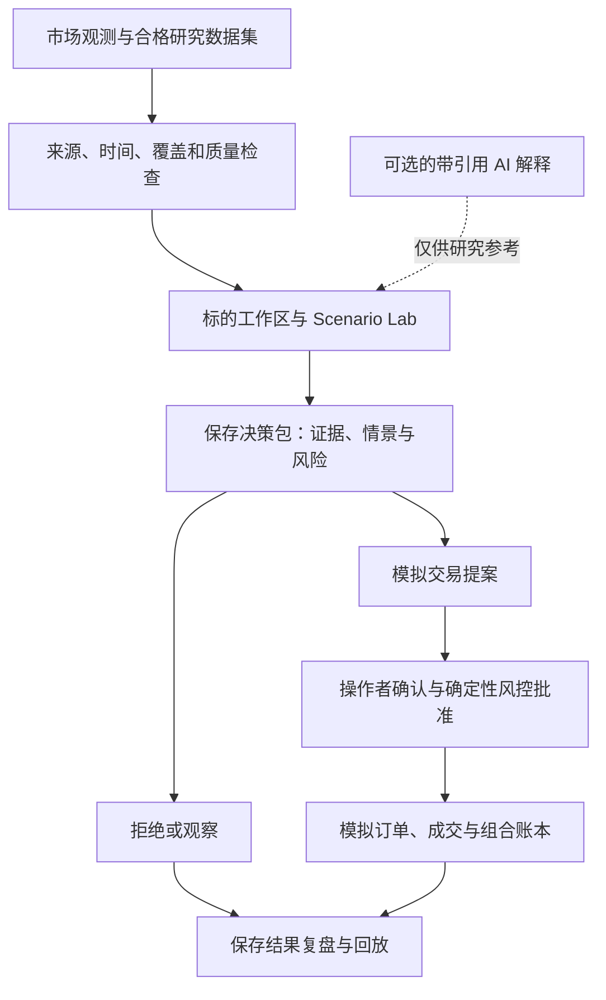

<div align="center">

# QuantMesh

**从市场证据，到可以回放的决策。**

面向跨市场研究、概率情景分析与确定性模拟交易的本地优先工作站。

[快速开始](#快速开始) · [核心工作流](#核心工作流) ·
[生产就绪情况](#生产就绪情况) · [文档](#文档) · [English](README.md)

[](https://github.com/ZP151/quantmesh/actions/workflows/ci.yml)
[](https://github.com/ZP151/quantmesh/actions/workflows/security.yml)
[](LICENSE)

</div>

QuantMesh 帮助个人研究者和活跃交易者，把图表与决策背后的证据、不确定性、
风险和结果连接起来。检查一个标的，保存 **DecisionPacket（决策包）**，
选择拒绝、观察或模拟交易提案，再回到当时掌握的信息复盘。

**当前阶段：** 已验收的本地原型，以及范围明确的私有 AWS 验收站。
`v0.1.1-rc1` 是已接受的原型基线；`main` 包含之后直到 0035 迭代的决策、
情景、复盘和实时图表能力。正式 `v0.1.1` 晋级和真实资金交易仍需通过独立关卡。
证据及适用范围见[生产就绪情况](#生产就绪情况)。

## 为什么是 QuantMesh？

一次研究往往最终只留下截图、Notebook 或一笔交易，背后的判断依据却丢失了。
QuantMesh 将这些依据与结果保存在同一条链路中。

- **在一个工作区完成判断。** 同时检查观测价格、牛市/基准/熊市场景、预测证据和风险。
- **知道数据能够支持什么。** 行动前检查来源、时间、实际覆盖范围、新鲜度和缺失证据。
- **通过确定性控制演练。** 报价校验、仓位限制、成本模型和熔断约束模拟订单，AI 无法绕过。
- **基于原始证据学习。** 已保存的预测和结果复盘保留各自身份，后来的数据不会静默改写当时的判断。

产品的核心指标是**完成可复现的决策闭环**：检查证据、记录决策、模拟或拒绝，
并在重启后恢复依据与结果。目标用户和衡量方式见[产品战略](docs/product-strategy.md)。

## 核心工作流

| 工作流 | 工作站中的操作 | 结果与边界 |
| --- | --- | --- |
| 开始决策会话 | 打开决策收件箱，检查数据就绪情况，主动刷新本地观察条件，打开对应决策包。 | 聚焦已触发、被阻断或待复盘的决策；刷新不会启动数据源采集。 |
| 研究一个标的 | 在标的工作区查看图表、情景、来源、当前模拟敞口和风险。 | 保存带证据引用的拒绝、观察或模拟交易提案。 |
| 探索概率情景 | 在 Scenario Lab 中分析 AAPL/NVDA 日线、7/30 个交易时段的预测证据和已保存图表上下文。 | 回放保存的分析；证据缺失或未达标时阻断依赖它的行动。 |
| 观察真实加密行情 | 在已配置的实时模式中，从市场页或自选页打开 BTC/ETH/SOL。 | 检查标注来源的折线/蜡烛图，以及保留的日内观测。 |
| 演练交易 | 审阅模拟提案，经确定性风控检查后确认。 | 追溯订单、成交、持仓、盈亏与审计；保存提案本身不会提交订单。 |
| 复盘结果 | 将保存的预测与对应的实际日收盘价比较，并记录复盘。 | 查看误差和区间命中指标；不完整路径不会生成完整路径分数。 |

界面支持 English / 简体中文、系统 / 浅色 / 深色主题、键盘导航和本地持久化显示偏好。

### 工作方式



**DecisionPacket** 是带版本的决策记录，包含某个标的在当时的市场状态、情景、
风险计划、证据引用和操作者判断。它与后续模拟交易、复盘记录的关联让整个闭环可检查。

## 快速开始

### 启动本地演示

以下锁定依赖的安装路径需要 **Git 和 Python 3.13**（CI 基线）。
Windows PowerShell 是主要本地操作路径；
Linux 用于 CI 和私有部署验收。Python 包已包含构建好的 React 界面，
运行时不需要 Node.js 或前端构建。演示不需要券商账户、钱包或模型 API Key。

在新目录中打开 PowerShell：

```powershell
git clone https://github.com/ZP151/quantmesh.git
Set-Location quantmesh
py -3.13 -m venv .venv
.\.venv\Scripts\python.exe -m pip install --upgrade pip
.\.venv\Scripts\python.exe -m pip install -e . -c requirements-audit.txt
.\.venv\Scripts\quantmesh-workstation.exe --demo
```

打开[本地工作站](http://127.0.0.1:8765/app/)。保持终端运行，按 `Ctrl+C` 停止。
命令直接指定可执行文件，不需要激活 PowerShell 脚本。演示也不需要拉取参考项目子模块。

<details>
<summary>Linux shell 命令</summary>

```bash
git clone https://github.com/ZP151/quantmesh.git
cd quantmesh
python3.13 -m venv .venv
.venv/bin/python -m pip install --upgrade pip
.venv/bin/python -m pip install -e . -c requirements-audit.txt
.venv/bin/quantmesh-workstation --demo
```

使用支持 venv 的 Python 3.13 解释器，访问地址相同。

</details>

### 完成第一个决策闭环

1. 确认界面显示 **Demo / 演示**，从市场页或自选页打开 NVDA。
2. 检查图表、Scenario Lab、预测时段和证据状态。
3. 保存分析并选择**观察**或**拒绝**。如要演练模拟交易，先检查提案，
   仅在证据和风控允许时确认。
4. 重新打开已保存的决策包及其复盘，核对原始依据和已有结果；尚未观测到的结果保持待定。
5. 需要重新演练时使用**重置演示**，恢复种子场景。重置仅限带标记的演示根目录。

演示价格和预测是明确标注、可确定性重现的合成数据，用于演示流程，不证明预测表现。

### 接入只读实时数据

先停止演示进程，再执行：

```powershell
$env:QUANTMESH_LIVE_WATCHLIST = "BTC,ETH,SOL"
.\.venv\Scripts\quantmesh-workstation.exe --live
```

这会连接 Hyperliquid 公开永续合约行情，不需要钱包。进入**市场 → 实时标的**
或**自选 → 实时标的**，选择币种并使用 **1D / 折线**。
在积累足够观测之前，图表可能显示采集中或不可用。图表展示实际记录的覆盖范围，
选择 1D 不代表已经拥有完整一天的历史。

`--live` 选择的是**行情运行模式**。默认仍为模拟盘，真实资金交易保持关闭。
`--demo` 与 `--live` 不能同时使用。通过[实时图表验收指南](docs/runbooks/live-chart-acceptance.md)
和[连接器检查清单](docs/runbooks/live-cockpit-operator-checklist.md)检查来源新鲜度及降级状态。

## 市场与运行模式

| 范围 | 当前能力 | 配置与验收边界 |
| --- | --- | --- |
| 本地演示 | 预置跨市场研究和模拟流程；AAPL/NVDA 情景与复盘路径。 | 无凭据、合成数据、可重置。 |
| Hyperliquid 实时数据 | BTC/ETH/SOL 公开永续报价、市场观测和日内折线/蜡烛图。 | 需要网络；私有 AWS 验收仅覆盖这三个标的及其实际观测范围。 |
| Moomoo 股票 | 只读 OpenD 适配器及 AAPL/NVDA 工作区路径。 | 需要可达的 OpenD 主机和实际行情权限；私有 AWS 连通与实源验收是下一步，现有轮询并非原生逐笔推送。 |
| 预测市场 | Polymarket/Kalshi 市场发现、映射、概率与连接器基础。 | 尚未完成 AWS 全市场验收；Polymarket 活跃合约订阅/映射及 Kalshi WebSocket 认证仍需分别处理。 |
| 私有 AWS 预发布环境 | 单操作者工作站、私有 HTTPS、持久化数据、精确构建健康检查和保留版本回滚。 | 按[部署手册](docs/runbooks/aws-private-staging.md)显式配置；实例防火墙验收仍见 [#135](https://github.com/ZP151/quantmesh/issues/135)。 |

记录下来的日内回放与经数据清单验证的合格历史数据相互独立。实时价格本身不能让预测达标、
解除模拟决策阻断或晋级策略。市场访问条件与数据使用权需分别确认。

## 数据与行动边界

**本地优先指默认运行位置和存储方式。** 行情连接会访问数据提供方。
可选 AI 使用配置的模型网关，默认端点为回环地址；显式授权的远程模型集成可能将研究内容发送到本机之外。

| 边界 | 行为 |
| --- | --- |
| 本地状态 | 默认位于 `~/.quantmesh`；演示隔离在 `demo`，实时观测、订单、决策和研究产物使用独立根目录。配置前缀为 `QUANTMESH_`，见[配置定义](src/quantmesh/settings.py)。 |
| 网络访问 | 工作站绑定回环地址。私有部署通过 Tailscale HTTPS 和精确配置的浏览器来源访问，面向单操作者。 |
| 数据质量 | 真实、延迟、过期、不可用、合成和回放状态保持可区分，缺失证据明确展示。 |
| AI | 可选、结构化、仅供参考；可解释带引用的证据，不能签名、下单、撤单或调整仓位。 |
| 交易 | 默认模拟盘；确定性风控、报价新鲜度、限额和熔断约束订单路径。实盘需单独授权的版本和证据关卡。 |
| 恢复 | 保留数据和精确版本身份；中断后先检查日志与对账，再决定是否重试，按事件处理手册操作。 |

凭据、私钥、本地配置和私有研究日志不应进入提交或 Issue。研究与预测存在不确定性，
项目不承诺盈利预测。

## 生产就绪情况

QuantMesh 的目标是可靠的日常运行。目前证据支持范围明确的原型与私有预发布使用，
尚未建立通用生产可用性或真实资金交易就绪结论。

### 已记录的证据

- **原型基线：** `v0.1.1-rc1` 通过了已记录的干净检出发布检查和浏览器验收。
  它是不可变基线，之后 `main` 的能力不包含在该标签内。
  详见 [0020 迭代](docs/iterations/0020-research-to-paper-loop.md)。
- **决策与学习闭环：** 0027–0029、0032–0033 交付证据决策、数据就绪会话、
  Scenario Lab 和保存预测的精确复盘。[迭代记录](docs/iterations/INDEX.md)
  分别记录实现检查、操作者验收与部署证据。
- **私有真实图表验收：** **2026-09-13**，部署版本
  [`76203e0`](https://github.com/ZP151/quantmesh/commit/76203e03476b120e149a0c06d9932849bb4d8e14)
  完成 **601.662 秒**的 BTC/ETH/SOL AWS 配对观测。市场/自选六条入口、
  真实分钟内修订与新分钟追加、重载保留均通过。**296 次工作区请求**全部完成，
  无失败或超时；模拟盘开启、实盘执行关闭。详见
  [可移植证据](docs/iterations/evidence/0035/aws-sustained-witness-summary.json)
  和[包含先前失败的完整记录](docs/iterations/0035-live-instrument-charts.md)。

这十分钟证据只适用于对应版本、环境和标的范围，不证明无限期在线、完整历史覆盖、
预测质量或其他部署当前的健康状态。

### 扩大使用前的关卡

- 完成独立的 [168 小时数据底座稳定性证据](https://github.com/ZP151/quantmesh/issues/124)
  和[私有部署防火墙验收](https://github.com/ZP151/quantmesh/issues/135)。
- 按市场分别验证实际连通、订阅、权限、来源时间和不可用/休市状态。
- 将合格、交易日历正确的历史接入情景与复盘；策略晋级前要求按时间顺序的样本外评估，
  并纳入手续费、价差和滑点。预测误差不等于交易表现。
- 对实际分发或部署的产物重跑[发布关卡](docs/release-process.md)、恢复演练和操作者验收。
  正式版本晋级仍由操作者明确决定。

## 路线图

| 阶段 | 结果 |
| --- | --- |
| 已交付：基础与工作站，0000–0020 | 确定性模拟内核、研究/数据适配器、风控审计、React 工作站、本地化和标的决策工作区。 |
| 已交付：持久证据，0021–0026 | 可信数据底座、持久账本、对账、数值策略和本地运行时；稳定性观测仍是独立关卡。 |
| 已交付：决策与学习，0027–0029 / 0032–0033 | 决策 Copilot、收件箱、就绪会话、Scenario Lab 和冻结的预测结果复盘。 |
| 已通过限定部署验收：0034–0035 | 私有 BTC/ETH/SOL 实时观测及可回放真实图表。 |
| 下一步 | 私有 Moomoo/OpenD 连通和 AAPL/NVDA 权限，再进行预测市场实源验收。 |
| 随后 | 合格历史贯通情景、决策与复盘；仅针对已证明的工作流缺口扩展模型。 |
| 单独设关卡 | 正式版本晋级，以及受控券商/测试网或真实资金执行。 |

[当前交付计划](docs/ITERATION_PLAN.md)规定顺序和验收标准，
[路线图](docs/roadmap/ROADMAP.md)保留里程碑历史。团队 SaaS、无限制自动交易、
资金托管和高频执行不在当前产品范围内。

## 开发与贡献

在仓库根目录安装开发与测试依赖闭包：

```powershell
.\.venv\Scripts\python.exe -m pip install -e ".[dev,research,e2e,moomoo]" -c requirements-audit.txt
.\.venv\Scripts\python.exe -m playwright install chromium
.\.venv\Scripts\python.exe -m pytest -q
.\.venv\Scripts\ruff.exe check src tests tools
git diff --check
git submodule status
```

前端开发还需要 **Node.js 22.12.0**（CI 基线）和 npm。在同一 PowerShell 会话执行：

```powershell
Set-Location frontend
npm ci
npm run check:api
npm run typecheck
npm run lint
npx vitest run
Set-Location ..
.\.venv\Scripts\python.exe tools/build_frontend.py --check
```

修改前端源码后，去掉 `--check` 运行 `tools/build_frontend.py`，并在 PR 中提交更新的打包产物。
CI 还检查依赖许可证、漏洞和生成的 API 客户端，见
[CI 工作流](.github/workflows/ci.yml)和[安全工作流](.github/workflows/security.yml)。

先创建说明一个用户动作与验收标准的 [GitHub Issue](https://github.com/ZP151/quantmesh/issues)。
遵循 [AGENTS.md](AGENTS.md)，保持切片范围明确，更新测试和迭代证据后提交 PR。
引入依赖或复制代码前检查[复用矩阵](docs/REUSE_MATRIX.md)，保留上游署名。

## 排障与支持

| 现象 | 优先检查 |
| --- | --- |
| 8765 端口被占用 | 停止先前的演示/实时进程，或用 `--port 8766` 启动并访问对应端口。 |
| 工作站为空 | 使用 `--demo` 进入预置流程；未配置的模拟运行时不会预置研究证据。 |
| 实时图表采集中、过期或不可用 | 检查观察列表、连接、来源时间和实际覆盖；按[图表验收指南](docs/runbooks/live-chart-acceptance.md)排查。 |
| 预测或模拟操作被阻断 | 查看缺失历史、新鲜度、预测身份与风控原因；当前报价不能补足研究历史。 |
| 前端打包缺失或过期 | 安装前端依赖，运行 `tools/build_frontend.py` 并重启工作站。 |
| 模拟状态对账失败 | 再次操作前阅读[对账事件手册](docs/runbooks/incident-reconciliation-mismatch.md)。 |

可复现的问题请[提交 Issue](https://github.com/ZP151/quantmesh/issues/new)，
附 Git 提交、OS/Python 版本、运行模式、最小步骤和脱敏日志，不要包含凭据或原始账户数据。

## 文档

| 需要了解 | 入口 |
| --- | --- |
| 产品方向与用户目标 | [产品](PRODUCT.md) · [战略](docs/product-strategy.md) |
| 当前范围与交付证据 | [交付计划](docs/ITERATION_PLAN.md) · [迭代索引](docs/iterations/INDEX.md) · [路线图](docs/roadmap/ROADMAP.md) |
| 架构和组件边界 | [领域上下文](CONTEXT.md) · [架构决策](docs/adr) · [复用矩阵](docs/REUSE_MATRIX.md) |
| 数据采集与运行 | [可信数据操作](docs/runbooks/trusted-data-operator.md) · [私有部署](docs/runbooks/aws-private-staging.md) |
| 发布与安全 | [发布流程](docs/release-process.md) · [威胁模型](docs/threat-model.md) · [熔断处理](docs/runbooks/incident-kill-switch-engaged.md) |
| 存储事件 | [磁盘耗尽](docs/runbooks/incident-disk-exhaustion.md) · [日志损坏](docs/runbooks/incident-journal-corruption.md) |

### 架构概览

React / TypeScript 与 Lightweight Charts 构成操作界面，FastAPI 提供打包界面和本地 API。
领域模型、研究、风控和执行通过适配器分离。DuckDB/Parquet 保存研究与回放数据，
专用存储与日志保留模拟交易和决策证据。

| 区域 | 源码 |
| --- | --- |
| 工作站界面 | [`frontend/src`](frontend/src) |
| 本地 API 与运行时 | [`src/quantmesh/api`](src/quantmesh/api) |
| 决策、情景与复盘 | [`src/quantmesh/instruments`](src/quantmesh/instruments) |
| 数据、研究和可选 AI | [`data`](src/quantmesh/data) · [`research`](src/quantmesh/research) · [`ai`](src/quantmesh/ai) |
| 确定性权限边界 | [`domain`](src/quantmesh/domain) · [`execution`](src/quantmesh/execution) · [Hyperliquid 风控](src/quantmesh/hyperliquid/risk.py) |
| 实时观测与集成契约 | [`live`](src/quantmesh/live) · [`connectors`](src/quantmesh/connectors) |

QuantMesh 参考 [OpenBB](https://github.com/OpenBB-finance/OpenBB)、
[Freqtrade](https://github.com/freqtrade/freqtrade) 和
[NautilusTrader](https://github.com/nautechsystems/nautilus_trader) 的数据、模拟流程及事件/回放模式。
参考项目和评估框架不会自动成为运行依赖；复用矩阵与 ADR 记录实际准入和许可证决策。

## 许可证

[Apache License 2.0](LICENSE)。第三方组件保留各自许可证和声明；行情数据与托管服务条款另行适用。

<div align="center">

**有来源的证据 → 审慎决策 → 可回放的结果**

</div>
